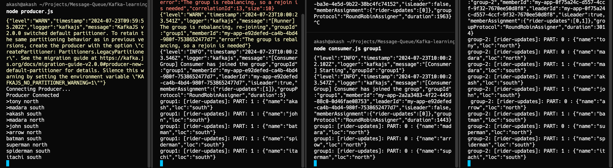

## Kafka

### Prerequisite
- **Knowledge**
  - Node.JS Intermediate level
  - Experience with designing distributed systems
- **Tools**


 
 


### Commands
- Start Zookeeper Container and expose PORT 2181.
  ```bash
  docker run -p 2181:2181 zookeeper
  ```
- Start Kafka Container, expose PORT 9092 and setup ENV variables.
  ```bash
  docker run -p 9092:9092 \
  -e KAFKA_ZOOKEEPER_CONNECT=<PRIVATE_IP>:2181 \
  -e KAFKA_ADVERTISED_LISTENERS=PLAINTEXT://<PRIVATE_IP>:9092 \
  -e KAFKA_OFFSETS_TOPIC_REPLICATION_FACTOR=1 \
  confluentinc/cp-kafka
  ```
Certainly! Here's an overview of what each file does without including specific code:

---

## Kafka Crash Course Overview

### Files and Their Purpose

### `client.js`
This file initializes a Kafka client configuration using the `kafkajs` library. It sets up connection details like the Kafka broker's IP address and other necessary configurations.

### `admin.js`
The `admin.js` file handles administrative tasks related to Kafka. It connects to the Kafka cluster as an admin and performs operations like creating topics (`rider-updates` in this case) with specified partitions.

### `producer.js`
The `producer.js` file simulates a producer application. It connects to the Kafka broker, takes user input (e.g., rider name and location), and sends messages to the `rider-updates` topic. Messages are partitioned based on the location (north or south).

### `consumer.js`
The `consumer.js` file sets up a Kafka consumer. It connects to the Kafka broker with a specified consumer group ID and subscribes to the `rider-updates` topic. It listens for incoming messages and logs them to the console, indicating the consumer group, topic, partition, and message content.

### Running Locally

To run these components locally:

- **Run Multiple Consumers**: Execute `node consumer.js <GROUP_NAME>` in the terminal to start multiple consumer instances, each with a unique consumer group name.
  
- **Create Producer**: Execute `node producer.js` in the terminal. It prompts for input (e.g., `tony south`, `tony north`), which sends location updates for a rider named Tony to the Kafka broker.

---

This overview provides a clear understanding of the purpose of each file in the Kafka setup and how to run and interact with them locally. Adjustments to file contents or configurations should align with your specific Kafka environment and requirements.

### Running Locally
- Run Multiple Consumers
  ```bash
  node consumer.js <GROUP_NAME>
  ```
- Create Producer
  ```bash
  node producer.js
  > tony south
  > tony north
  ```

---

This Markdown document outlines a crash course on Apache Kafka, including prerequisites, commands to set up Kafka and Zookeeper using Docker, example Node.js code snippets for Kafka clients (producer, consumer, admin), and instructions for running producers and consumers locally. Adjust `<PRIVATE_IP>` and `<GROUP_NAME>` placeholders as necessary for your setup.


Certainly! Here are 5 points focusing on load balancing based on the provided logs:

1. **Producer and Message Sending**:
   - The Kafka producer (`node producer.js`) connects and starts sending messages to the `rider-updates` topic.
   - Messages like `"tony north"`, `"madara south"`, etc., indicate updates from different locations.

2. **Consumer Group Initialization**:
   - Consumers (`node consumer.js group1`) initialize and join `group1`, a consumer group.
   - Kafka assigns partition 1 of the `rider-updates` topic to `group1` (`group1: [rider-updates]: PART: 1 : {"name": "akash", "loc": "south"}`, etc.).

3. **Partition Assignment**:
   - Another consumer (`group-2`) concurrently consumes messages from partition 0 and 1 of `rider-updates`.
   - This distribution ensures each partition is processed by only one consumer within the group, enabling parallelism and efficient data handling.

4. **Rebalancing and Dynamic Adjustment**:
   - Kafka dynamically rebalances partitions among consumers when new consumers join or leave the group.
   - This ensures even workload distribution (`{"level": "INFO", "message": "[Consumer Group] Consumer has joined the group", ...}`) and maintains optimal performance.

5. **Efficiency and Scalability**:
   - The round-robin partitioning strategy (`"groupProtocol": "RoundRobinAssigner"`) distributes partitions cyclically among consumers within the group.
   - Enables horizontal scaling by adding more consumers as needed, ensuring scalability and fault tolerance in handling increased message volumes.

